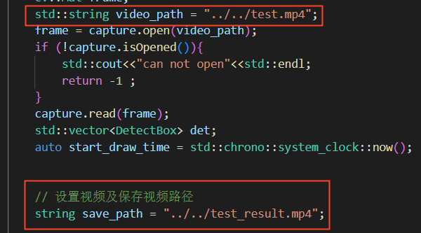
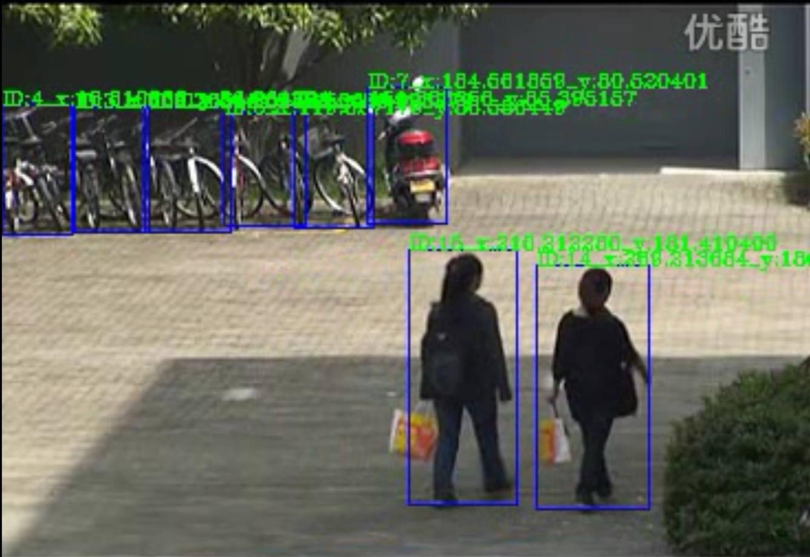

# yolov5-deepsort 在tensorrt的部署与推理
    注： 本工程所选用的yolov5模型为Tags：yolov5-v5.0

### 启动容镜像 
    sudo docker run -it --runtime=nvidia --shm-size=128G yolov5_deepsort_tensorrt:v5.0 /bin/bash 
> 镜像获取路径： 

## 快速实施
工程目录：
>   
    修改 deepsort_train/deep_sort/deep/model.py中的num_classes，将其设置为你自己deepsort训练时所需要的类别数
>   
>   依据上图，修改 yolov5_deepsort_tensorrt_deploy/src/run.cpp 中video_path 和 save_path 原测试视频路径和视频储存路径

   1. 准备训练好的deepsort模型 储存在 ./model_origin (模型名字保持一致为 “yolov5.pt”)
   2. 准备训练好的yolov5模型 储存在 ./model_origin (模型名字保持一致为 “deepsort_best.pt”)
   3. 运行脚本 bash runs.sh s  （注意：后面s对应所选择的yolov5模型大小，有：s,m,l,x）

## 分步实施   
### 目录：   
    0.0  工程主目录
    0.1  准备文件
    1.0  yolov5模型的转换 （pt ——> trt ——> engine）
    1.1  deepsort模型的转换 （pt ——> onnx ——> engine）
    1.2  yolov5的engine模型和deepsort的engine模型结合运行
    2.0  算法原理说明

### 0.0  工程主目录
    ---deepsort_train
    ---yolov5_train
    ---tensorrtx
    ---yolov5_deepsort_tensorrt_deploy

### 0.1  准备文件
    已经训练好的yolov5的pt模型，如：yolov5s.pt
    已经训练好的deepsort中deep模型，如：ckpt.t7   （注： .t7格式和pt格式的模型是一样的，可以改变，官方用t7来区分）

### 1.0  yolov5模型的转换 （pt ——> trt ——> engine）
    a. pt ---> trt
        1. cd yolov5_train/  （工程主目录）
        2. 将yolov5s.pt模型文件储存在weights目录下
        3. 运行 python3 gen_wts.py -w ./weights/yolov5s.pt -o ./weights/yolov5s.wts
            (运行生成 ./weights/yolov5s.wts)
    b. trt ---> engine
        4. cd tensorrtx/yolov5-tensorrt/  （工程主目录）
        5. mkdir build
        6. cd build
        7. cmake ..
        8. make
        9.  ./yolov5 -s ../../yolov5_train/weights/yolov5s.wts yolov5s.engine s (最后s表示转换的是yolov5s模型，
        转换yolov5l模型用l，具体用法，用 ./yolov5 查看)
        10. ./yolov5 -d yolov5s.engine ../samples (对engine模型做推理测试)

### 1.1  deepsort模型的转换 （pt ——> onnx ——> engine）
    a. pt ---> onnx
        1. cd deepsort_train  （工程主目录）
        2. 修改配置文件 config/deep_sort.yaml 各参数
            （参数解析：
                        RID_CKPT为deep模型存放的路径
                        MAX_DIST：最大余弦距离，用于级联匹配；
                        MIN_CONFIENCE:置信度阈值；
                        NMS_MAX_OVERLAP：非极大值抑制阈值；
                        MAX_IOU_DISTANCE：最大IOU阈值；
                        MAX_AGE:最大寿命，即经过MAX_AGE帧没有追踪到该物体，删除该轨迹；
                        N_INIT：最高击中次数，击中该次数，目标物由不确定态转为确定态；
                        NN_BUDGET：最大保存特征帧数）
        3. 运行 python3 exportOnnx.py 在同级目录下生成deepsort.onnx
    b. onnx ---> engine
        4. cd tensorrtx/deepsort-tensorrt （工程主目录）
        5. 将步骤3生成的 deepsort.onnx 复制到./resources 
        6. mkdir build
        7. cd build
        8. cmake ..
        9. make
        10 ./onnx2engine ../resources/deepsort.onnx ../resources/deepsort.engine
            (将deepsort.onnx 转换为deepsort.engine，存放在resource目录下)

### 1.2  yolov5的engine模型和deepsort的engine模型结合运行
    
    1. cd yolov5-deepsort-tensorrt  （工程主目录）
    2. 将1.0和1.2分别生成的yolov5的engine和deepsort的engine复制到 ./weights 目录下
    3. mkdir build
    4. 修改 src/run.cpp 中 //char* yolo_engine = "";和 char* sort_engine = "";
        为自己yolov5模型和deepsort模型的位置； std::string video_path 修改为测试视频路径，string save_path= "../../test_result.mp4" 为保存视频路径；如果使用usb摄像头，
        就写成 std::string video_path = “0”
    5. cmake ..
    6. make (生成yolosort 二进制文件)
    7. ./yolosort 运行程序，推理视频并保存推理的结果文件
    
    ### 运行结果展示（从视频中截取其中一帧）
    
    

